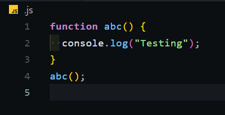
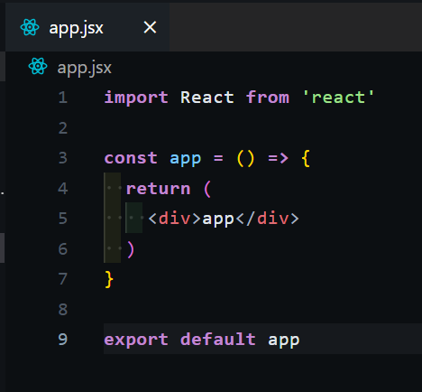
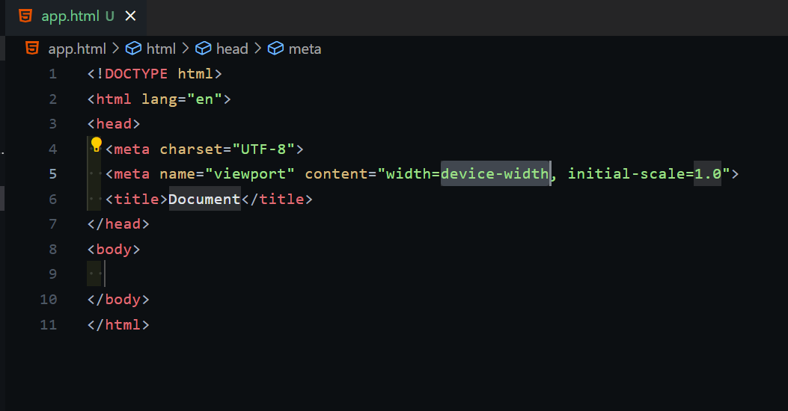

# Lucifer Dark Theme for VS Code

A **minimal**, **beautiful**, and **visually balanced** dark theme for developers who love clean interfaces and smooth coding experience. Inspired by macOS elegance and Linux terminal color vibes.

---
## ✨ Features

- Subtle dark background for reduced eye strain
- Neutral, soft, and professional syntax highlighting
- Vibrant but non-poppy colors for variables, functions, keywords, and strings
- Compatible with popular fonts like `Fira Code`, `JetBrains Mono`, `Dank Mono`
- Smooth cursor animations and font ligatures

---

## 🖼️ Screenshots

### JavaScript


### React + JSX


### HTML


---

## 📦 Installation (Local)

1. Download or clone this repository.
2. Open the terminal inside the theme folder.
3. Run:

   ```bash
   npm install -g @vscode/vsce
   vsce package
